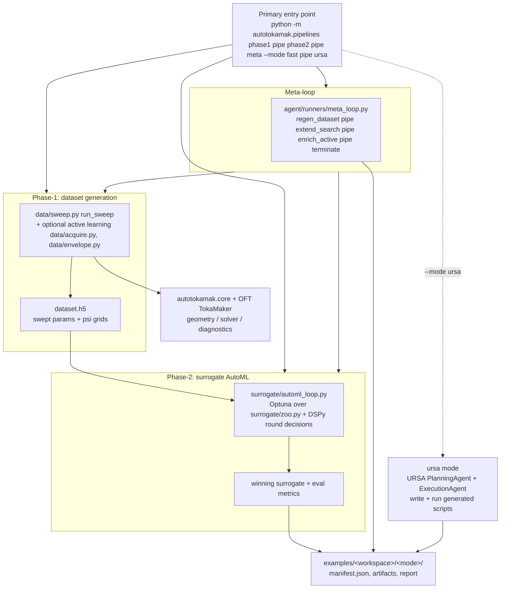

# autotokamak

ML surrogate models and agentic LLM workflows for the **Grad–Shafranov equation** — built on top of:
- **[OpenFUSIONToolkit (OFT)](https://github.com/OpenFUSIONToolkit/OpenFUSIONToolkit)** — TokaMaker for ground-truth GS solves.
- **[URSA](https://github.com/lanl/ursa)** — LangChain/LangGraph agent framework for plan/execute workflows.

Built as a summer RA project at **MIT Energy Initiative**.

The platform runs as three phases behind one CLI: **Phase-1** generates a Grad–Shafranov
parameter-sweep dataset, **Phase-2** runs surrogate AutoML over that dataset, and the
**meta-loop** chains the two into a self-improving outer loop. Each phase runs in either
`fast` mode (in-process library code) or `ursa` mode (a URSA agent writes and runs the
code). See [Running the platform](#running-the-platform) below.

---

## Documentation

- [docs/architecture.md](docs/architecture.md) — high-level layering and data flow.
- [docs/agent-workflows.md](docs/agent-workflows.md) — how runners and prompts work.
- [docs/examples.md](docs/examples.md) — how to run and interpret example workspaces.
- [docs/configs.md](docs/configs.md) — agent task YAML vs simulation config YAML.
- [docs/glossary.md](docs/glossary.md) — beginner-friendly definitions of core terms.
- [docs/development-notes.md](docs/development-notes.md) — migration notes and conventions.

---

## Setup (macOS / Linux)

```bash
python3.11 -m venv venv && source venv/bin/activate

# Editable install: pulls in OpenFUSIONToolkit, URSA, pydantic, h5py, etc.
pip install -e ".[ml,dev]"

# Agent runners need OpenAI access:
echo 'OPENAI_API_KEY=sk-...' > .env

# Optional: side-clone OFT and URSA source if you want to browse their examples
git clone https://github.com/OpenFUSIONToolkit/OpenFUSIONToolkit.git
git clone https://github.com/lanl/ursa.git
```

Python **must be 3.11 or 3.12**. OpenFUSIONToolkit (v26.6+) is on PyPI, so no
`/Applications/` install or `PYTHONPATH` exports are needed.

### Verify the install

```bash
python -c "from autotokamak.core import solver, geometry, schema; print('OK')"
pytest tests/ -v
```

---

## First example: Fixed-boundary equilibrium (OFT TokaMaker)

The **first example** in this repo is the **OpenFUSIONToolkit TokaMaker fixed-boundary equilibrium** workflow in `examples/fixed_boundary/`. It is a standalone Python script that:

- Builds and solves a **fixed-boundary Grad–Shafranov equilibrium** using OFT’s TokaMaker in fixed-boundary mode.
- Supports two cases:
  - **`--case analytic`**: the plasma boundary (LCFS) is generated analytically (e.g. an isoflux-shaped boundary).
  - **`--case eqdsk`**: the boundary is loaded from OFT’s bundled EQDSK example.
- For each run it: creates or reads the LCFS boundary, builds a GS domain mesh, configures TokaMaker with targets (e.g. total plasma current) and optional profiles, solves the equilibrium, and writes outputs (NPZ/JSON and optional PNG plots) under `examples/fixed_boundary/outputs/`.

**Quick run (from repo root, with venv active):**

```bash
cd examples/fixed_boundary
python run_fixed_boundary_equilibrium.py --case analytic
```

---

## Running the platform

The primary entry point is the unified pipelines CLI:

```bash
python -m autotokamak.pipelines <phase1|phase2|meta> --mode <fast|ursa> [opts]
```

| Command | Mode | What it does |
|---|---|---|
| `pipelines phase1 --mode fast` | library | `run_sweep` directly → `examples/dataset_generation/fast/` |
| `pipelines phase1 --mode ursa` | URSA codegen | agent writes `run_dataset_sweep.py` → `examples/dataset_generation/ursa/` |
| `pipelines phase2 --mode fast` | library | `automl_loop` (Optuna + DSPy) → `examples/surrogate_automl/fast/` |
| `pipelines phase2 --mode ursa` | URSA codegen | agent writes `run_surrogate_automl.py` → `examples/surrogate_automl/ursa/` |
| `pipelines meta --mode fast` | library | full self-improving meta-loop → `examples/surrogate_meta/fast/` |
| `pipelines meta --mode ursa` | hybrid | meta-loop with URSA codegen for nested Phase-2 → `examples/surrogate_meta/ursa/` |

Each run writes `examples/<workspace>/<mode>/manifest.json` (run_id, key paths, score).

Examples:

```bash
# Phase-1: generate a 500-sample dataset
python -m autotokamak.pipelines phase1 --mode fast --n-samples 500

# Phase-2: 10-minute AutoML search over the latest dataset
python -m autotokamak.pipelines phase2 --mode fast --time-budget 600

# Meta-loop: run until the surrogate is 90% better than the mean-predictor baseline
python -m autotokamak.pipelines meta --mode fast --target-accuracy-pct 90 --max-iterations 5
```

### Lower-level agent runners

The pipelines CLI dispatches to URSA runners under `src/autotokamak/agent/`. You can also
invoke these directly:

- **`agent/runners/plan_execute.py`** — plan → execute loop using URSA's PlanningAgent + ExecutionAgent.
- **`agent/runners/plan_execute_feedback.py`** — same, with a re-planning feedback loop after failures.
- **`agent/runners/meta_loop.py`** — the autonomous outer loop that drives Phase-1 → Phase-2 and decides each round whether to regenerate the dataset, extend the search, enrich with active learning, or terminate.
- **`agent/prompts/*.yaml`** — task YAMLs (problem statement, workspace, model, symlinks).

```bash
python -m autotokamak.agent.runners.plan_execute \
  --config src/autotokamak/agent/prompts/oft_example_generation.yaml
```

### End-to-end flow (inputs -> transforms -> outputs)



---

## Links

- **URSA**: [github.com/lanl/ursa](https://github.com/lanl/ursa) — Universal Research and Scientific Agent.
- **OpenFUSIONToolkit**: [github.com/OpenFUSIONToolkit/OpenFUSIONToolkit](https://github.com/OpenFUSIONToolkit/OpenFUSIONToolkit) — Open FUSION Toolkit (OFT) for plasma and fusion modeling.
