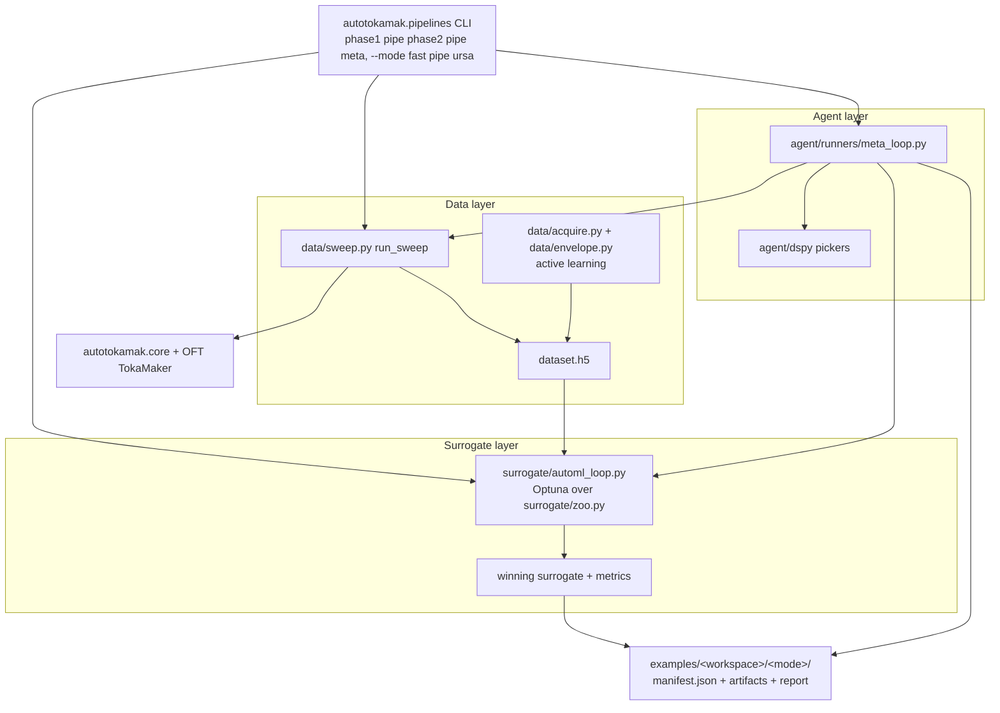

# Repository Architecture

This repository is the **`autotokamak`** package — a platform for ML surrogate
models of the Grad-Shafranov equation plus agentic LLM workflows that drive
TokaMaker simulations.

It is organized into these layers:

1. **`autotokamak.core`** — shared library of geometry, solver, I/O, and schema utilities used by every higher layer.
2. **`autotokamak.pipelines`** — the unified `phase1 | phase2 | meta` CLI (`--mode fast|ursa`); the primary entry point that orchestrates everything below. Also home of `discover.py`, which locates a run's artifacts for the `tools/` scripts.
3. **Data layer** (`autotokamak.data`) — parameter-sweep dataset generation, HDF5 I/O, and active-learning acquisition + envelope evaluation.
4. **Surrogate layer** (`autotokamak.surrogate`) — everything surrogate training: dataset loading/splitting (`dataset`), PCA reduction (`reduce`), metrics, the sklearn model zoo (`zoo`), the Optuna inner loop (`optuna_search`), the LLM-driven outer search loop (`automl_loop`), and run diagnostics for the meta-agent (`diagnostics`).
5. **Agent orchestration layer** (`src/autotokamak/agent/`) — URSA runners, the meta-loop, DSPy pickers, and the orchestrator.
6. **Runnable simulation examples layer** (`examples/`) — hand-runnable OFT workflows and generated agent workspaces.

Two example workspaces carry easily-confused names: `examples/surrogate_automl/`
is the **standalone Phase-2** AutoML workspace, while `examples/surrogate_meta/`
is the **meta-loop** workspace (which runs Phase-2 rounds internally). They are
distinct pipelines, not two names for one thing.

## Layer Boundaries

- `pipelines/` is the front door: each phase runs in `fast` mode (in-process library code) or `ursa` mode (a URSA agent writes and runs the code), and writes `examples/<workspace>/<mode>/manifest.json`.
- `agent/prompts/` contains task YAML prompts for URSA-driven runs.
- `agent/runners/` contains Python entrypoints: the URSA `plan_execute*` runners plus `meta_loop.py` (the autonomous Phase-1 → Phase-2 outer loop).
- `agent/dspy/` and `agent/orchestrator/` provide the LLM decision surface (action/search pickers) and the meta-loop action/schema layer.
- `examples/` contains hand-runnable OpenFUSIONToolkit workflows and generated artifacts.

The agent layer can generate or update content in `examples/`, but the examples are runnable without LLM involvement.

## Data Flow

## Entry Points

- **Primary — pipelines CLI:** `python -m autotokamak.pipelines <phase1|phase2|meta> --mode <fast|ursa>`
  - Phase-1 dataset: `python -m autotokamak.pipelines phase1 --mode fast --n-samples 500`
  - Phase-2 AutoML: `python -m autotokamak.pipelines phase2 --mode fast --time-budget 600`
  - Meta-loop: `python -m autotokamak.pipelines meta --mode fast --target-accuracy-pct 90`
- Lower-level agent run: `python -m autotokamak.agent.runners.plan_execute --config src/autotokamak/agent/prompts/oft_example_generation.yaml`
- Lower-level feedback run: `python -m autotokamak.agent.runners.plan_execute_feedback --config src/autotokamak/agent/prompts/oft_discretization_example.yaml`
- Fixed-boundary example: `python examples/fixed_boundary/run_fixed_boundary_equilibrium.py --case analytic`
- Config-driven example: `python examples/config_driven_equilibrium/run_equilibrium_from_config.py examples/config_driven_equilibrium/discretization_config.yaml`
- Tests: `pytest tests/ -v` (`-m slow` to include the full-solve smoke test)

## `autotokamak.core` API summary

| Module | Public functions | Used by |
|---|---|---|
| `geometry` | `build_lcfs`, `build_mesh`, `build_mesh_from_config` | Both example runners; future data sweeps |
| `solver` | `make_solver`, `solve_equilibrium` (retry-on-isoflux-fail) | `config_driven_equilibrium` runner; future surrogate evaluation |
| `io` | `atomic_write_text`, `atomic_savez`, `unified_output_dir`, `utc_run_id` | All runners that write artifacts |
| `schema` | `EquilibriumConfig` (Pydantic v2, `from_yaml`) | Single-run config validation. Dataset sweeps use `autotokamak.data.schema.SweepConfig`. |

## Development conventions

- All package code imports via the full `autotokamak.…` namespace (e.g.
  `autotokamak.agent.runners.plan_execute`). The historical bare `agent.…`
  namespace and its `PYTHONPATH=src/autotokamak` hack are gone.
- Do not modify side clones `OpenFUSIONToolkit/` and `ursa/`.
- Keep prompt `workspace:` values aligned with paths under `examples/`.
- The `pipelines/` layer deliberately unifies the agent and simulation phases
  behind one CLI; keep phase-specific logic in `data/`, `surrogate/`, and
  `agent/runners/` rather than in the thin CLI wrappers.
- Historical renames (for archaeology): `oft_generation_example/` →
  `examples/fixed_boundary/`, `oft_discretization_example/` →
  `examples/config_driven_equilibrium/`, flat `agent/*.py` →
  `agent/runners/*.py`.

## OFT singleton constraint

OpenFUSIONToolkit enforces **one `OFT_env` per Python kernel** — calling
`oft.OFT_env(...)` a second time raises. `core.solver.make_solver` accepts an
optional `env=` parameter for this reason: the retry path in
`solve_equilibrium` reuses the existing env rather than trying to create a
fresh one. Any batched solver (e.g. a training-data sweep that wants many
solves in one process) must follow the same pattern, OR run each solve in a
subprocess (which is what `examples/config_driven_equilibrium/forward_once.py`
does — recommended for sweeps).
